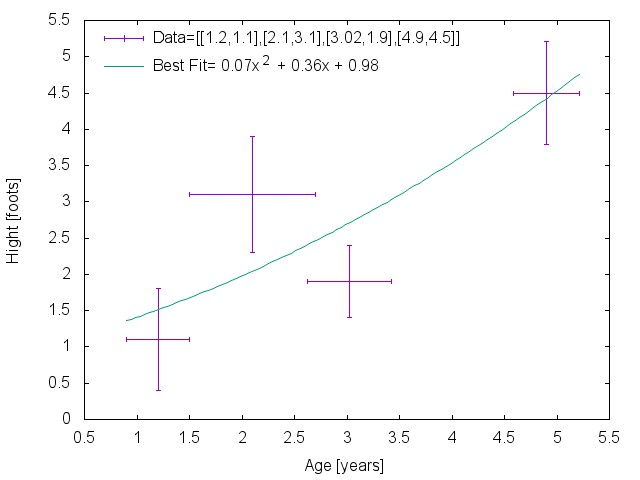

# JNsolve

[](https://gitter.im/4yopping/JNsolve?utm_source=badge&utm_medium=badge&utm_campaign=pr-badge&utm_content=badge)
[](https://travis-ci.org/4yopping/JNsolve) [](http://inch-ci.org/github/4yopping/JNsolve)
[](http://badge.fury.io/js/jnsolve)
**[Join us on Slack](http://jnsolve.slack.com)**

## Introduction

Solve numerically equations and calculate best fit to a data array given, also provides a series of numeric routines usable.


## Installation

```bash
$ npm install jnsolve
```


## Features


- **JNsolve bestfit**
- **JNsolve regulafalsi**
- **JNsolve fixedpoint**
- **JNsolve bisection**
- **JNsolve Newton-Raphson**
- **JNsolve Newton-Raphson-Higher-Order**
- **JNsolve Numerical Derivative**
- **JNsolve FindRoot**

## API

#### `JNsolve`

Initialize `JNsolve`

```js
var JNsolve = require('JNsolve');
```

#### `JNsolve#D`

Object with differents numerics methods to calculate the derivative of a function.

##### `JNsolve#D#Nof(Function,Number,Array)`
Constructor that generates the numeric derivative of `Function`=> f(x) with a  `Number` => N given of divisions in an interval  `Array` => [a,b].

```js
JNsolve.D.Nof(f,1000,[2,7])
```

##### `JNsolve#D#Nof#f_x`
Instance method what is the derivative numerical of  `Function` with a   `Number` given of divisions in an interval   `Array`.

```js
JNsolve.D.Nof(f,1000,[2,7]).f_x(3)
```
is a aproximation to the derivative of f (df_dx) on 3 with the 1000 divisions in the interval [2,7]. Is available another method that calculate the numerical derivative calculating the dx_i in a optimazed way, dx_i=h/sqrt(1+dfdx^2) with h=(b-a)/N.
##### `JNsolve#D_opt#Nof(Function,Number,Array)`
##### `JNsolve#D_opt#Nof#f_x`

##### `JNsolve#D#linear_interpolation(Array)`
Is a constructor that generates the numeric linear interpolation of data given in `Array`= [[x_1,y_2],[x_2,y_3],...[x_n,y_n]] in the interval [x_1,x_n].

```js
JNsolve.D.linear_interpolation([[0,3.2],[1,4.6],[2,5.1],[4,6.9]])
```
##### `JNsolve#D#linear_interpolation(Array)#function_interpolated`
Is a instance method what is the interpolated function of `Array` given.

```js
JNsolve.D.linear_interpolation([[0,3.2],[1,4.6],[2,5.1],[4,6.9]]).function_interpolated(2.5)
```
Is a aproximation interpolated to the `Array` = [[0,3.2],[1,4.6],[2,5.1],[4,6.9]].

#### `JNsolve#nsolveqn(Function, Array[,Number,Object])`
Is a method that calculate numerically the solution of `Function`=>f(x)=0 try in the interval (`Array`=>[a,b]) beginning  on `Number`=>x_0 (initial point).

```js
JNsolve.nsolveqn(x+Math.cos(x),0.5,[0,1]) = 0.73952
```
The `Object`is default options and are { npoints_DNumeric : 1000, presicion : 0.001 , nstepsmax : 1000 , method : 'Newton_Rapshon' }. The mothods available are RegulaFalsi, bisection,fixedpoint,Newton_Raphson_Higherorder, Newton_Raphson_Higherorder. The rest of routines for every method are availables:

#### `JNsolve#RegulaFalsi(Function,Array[,Object])`
#### `JNsolve#bisection(Function, Array[,Object])`
#### `JNsolve#fixedpoint(Function,Number[,Object])`
#### `JNsolve#Newton_Raphson(Function,Array[, Number, Object])`
#### `JNsolve#Newton_Raphson_Higherorder(Function,Array[, Number, Object])`

in every case if x_0 is undefined, is taken from a random number  in interval `Array`=>[a,b]. All these methods return a object with properties Root, numSteps and method used.

#### `JNsolve#findroot(Function, Array[,Number,Object])`
Is a method that calculate numerically the solution of `Function`=>f(x)=0 try in the interval (`Array`=>[a,b]) beginning  on `Number`=>x_0 (initial point).

```js
JNsolve.findroot(x+Math.cos(x),0.5,[0,1]) = 0.73952
```
The `Object`is default options and are { npoints_DNumeric : 1000, presicion : 0.001 , nstepsmax : 1000 , method : 'Newton_Rapshon' }. Here, findroot try find the root of function by all methods availables in the module.


#### `JNsolve#bestfit(Array[,Array,Array,Object])`



Caculate the best fit using the first `Array`= [[x_1,y_2],[x_2,y_3],...[x_n,y_n]] argument as data input, the second  `Array` = [z_1,z_2...z_m] argument are the values of x's for which is necessary calculate their y`s values respectively, the third argument are the values of "y" for which is queried the values of "x". The properties of options object are smoothing (default = True), noiseeliminate (default = True), smoothingmethod (default ='exponential' only by moment), alpha (default = 0.8). Return a object with the properties: ans_ofY,ans_ofX, fitUsed, fitEquationUsed, fitParamsUsed, fitPointsUsed, fitWithError and fit.

```js
JNsolve.bestfit([[0,1.1],[1,4.6],[2,1.9],[4,15]],[3.4, 4.8, 8, 11], [8,8.5,15,20]) =
fit = { ans_ofY:
   [ [ 3.4, 10.503636363636366 ],
     [ 4.8, 21.457999999999984 ],
     [ 8, 62.92272727272717 ],
     [ 11, 122.55181818181795 ] ],
  ans_ofX:
   [ [ 2.9665881626844426, 8 ],
     [ 3.0592101464091335, 8.5 ],
     [ 4.043974243768653, 15 ],
     [ 4.641597409834032, 20 ] ],
  fitUsed: 'polynomial',
  fitEquationUsed: 'y = 1.12x^2 + -1.33x + 2.11',
  fitParamsUsed: [ 2.1118181818181747, -1.3259090909090778, 1.1159090909090879 ],
  fitPointsUsed:
   [ [ 0, 2.1118181818181747 ],
     [ 1, 1.9018181818181847 ],
     [ 2, 3.9236363636363705 ],
     [ 4, 14.662727272727269 ] ],
  fitWithError: 2.0329834635543396,
  fit:
   { linear: { regression: [Object], error: 2.8540621486399553 },
     exponential: { regression: [Object], error: 2.094639809897245 },
     logarithmic: { regression: [Object], error: NaN },
     power: { regression: [Object], error: NaN },
     polynomial: { regression: [Object], error: 2.0329834635543396 },
     best: { name: 'polynomial', error: 2.0329834635543396, f: [Function] } } }
```


##Contributing
In lieu of a formal styleguide, take care to maintain the existing coding style.
Add unit tests for any new or changed functionality. Lint and test your code.  For any bugs report please contact to me via e-mail.

##Licence
The MIT License (MIT)

Copyright (c) 2015 Jesús Edel Cereceres with Andrés González and Marco Godínez as collaborators, 4yopping and all the related trademarks.

Permission is hereby granted, free of charge, to any person obtaining a copy
of this software and associated documentation files (the "Software"), to deal
in the Software without restriction, including without limitation the rights
to use, copy, modify, merge, publish, distribute, sublicense, and/or sell
copies of the Software, and to permit persons to whom the Software is
furnished to do so, subject to the following conditions:

The above copyright notice and this permission notice shall be included in
all copies or substantial portions of the Software.

THE SOFTWARE IS PROVIDED "AS IS", WITHOUT WARRANTY OF ANY KIND, EXPRESS OR
IMPLIED, INCLUDING BUT NOT LIMITED TO THE WARRANTIES OF MERCHANTABILITY,
FITNESS FOR A PARTICULAR PURPOSE AND NONINFRINGEMENT. IN NO EVENT SHALL THE
AUTHORS OR COPYRIGHT HOLDERS BE LIABLE FOR ANY CLAIM, DAMAGES OR OTHER
LIABILITY, WHETHER IN AN ACTION OF CONTRACT, TORT OR OTHERWISE, ARISING FROM,
OUT OF OR IN CONNECTION WITH THE SOFTWARE OR THE USE OR OTHER DEALINGS IN
THE SOFTWARE.
